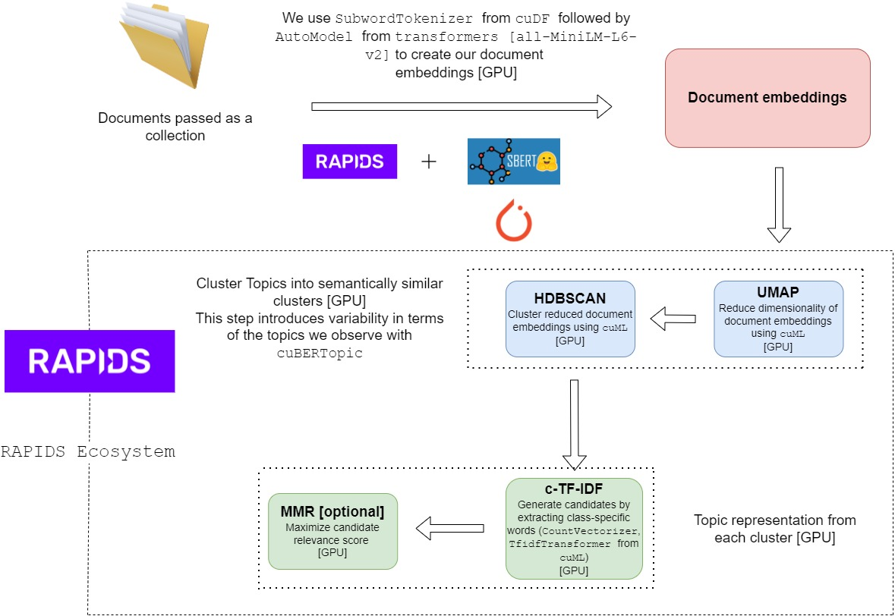

# cuBERT-topic-modelling

Leveraging BERT, TF-IDF and NVIDIA RAPIDS to create easily interpretable topics.

## Overview

Currently, [BERTopic](https://github.com/MaartenGr/BERTopic) library in general utilizes GPUs as part of the SenteneTransformer package, which is only used during the encoding process. We can accelerate other bits of the pipeline such as dimension reduction (UMAP), Topic Creation (Count/TF-IDF Vectorization), Clustering (HDBSAN) and Topic Reduction using the RAPIDS ecosystem that has a similar API as Pandas, sckit-learn but leverages GPUs for the end-to-end pipeline.



### Code organization

```
cuBERT_topic_modelling
│   README.md
│   berttopic_example.ipynb
|   ctfidf.py
|   cuBERTopic.py
|   embedding_extraction.py
|   mmr.py
|   setup.py
│
└───tests
│   │   test_ctfidf.py
│   │   test_data_preprocess.py
│   │   test_embeddings_extraction.py
|   |   test_fit_transform.py
|   |   test_hdbscan_clustering.py
|   |   test_mmr.py
|   |   test_subwordtokenizer.py
|   |   test_umap_dr.py
│   
└───utils
|   │   sparse_matrix_utils.py
│   
└───vectorizer
|   │   vectorizer.py
| 
└───conda
|   │   environment.yml
|
└───images
|   │   cuBERTopic.jpg
|
└───vocab
|   │   voc_has.txt
|   |   vocab.txt
|
```

## Installation

`cuBERTopic` runs on `cudf` and `cuml` which can be installed using instructions [here](https://rapids.ai/start.html). These packages run on NVIDIA GPU and CUDA and to determine the version you should install, you can check the CUDA version in your system (eg. do `nvidia-smi`). Here we assume the user has `conda` (or `mamba`) installed.

For example, if you have CUDA 11.2 and Ubuntu 20.04, then run:

```bash
conda create -n rapids-21.12 -c rapidsai-nightly -c nvidia -c conda-forge \
    rapids=21.12 python=3.8 cudatoolkit=11.2
conda activate rapids-21.12
```

We also provide a conda environment file [here](conda/environment.yml), which you can use to create the environment as: `conda env create -f conda/environment.yml`. This will create a conda environment called `topic_p` (the name can be chnaged in the file). Remember to change it according to the CUDA version in your system.

After installing the dependencies (creating the conda environment), clone the repository and run `pip install -e .` from the root directory. 

Now you can do `import cuBERTopic` and you're good to go!

Additionally, if you want to run and compare against `BERTopic` then you can find the instructions [here](https://github.com/MaartenGr/BERTopic). Essentially, just run: `pip install bertopic`

## Quick Start

An [example](berttopic_example.ipynb) notebook is provided, which goes through the installation, as well as comparing response using [BERTopic](https://github.com/MaartenGr/BERTopic). Make sure to install the dependencies by referring to the step above.

## Development

Contributions to this codebase are welcome! 

[conda-dev](conda/conda_dev_env.yml) file has been provided which included all the development dependencies. Using this file, you can create your own dev environment by running: 

```bash
conda env create -f conda/conda_dev_env.yml
```

We have written tests such that our correctness is verified by runnig `BERTopic` on the same input, hence it becomes a dependency to run our tests (`pip install bertopic`). Other Additional dependencies are `pytest` and `pytest-lazy-fixture`.

To run existing tests, you can do `pytest -v` from the root directory, and more tests can be added under `tests` as well.

## Acknowledgement

Our work ports the CPU implementation of the [BERTopic library](https://github.com/MaartenGr/BERTopic) to a python-based GPU backend using NVIDIA RAPIDS.

Please refer to Maarten Grootendorst's [blog](https://towardsdatascience.com/topic-modeling-with-bert-779f7db187e6) on how to use BERT to create your own topic model.
